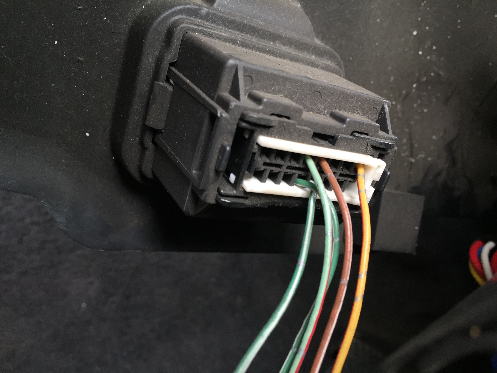

1997 Subaru Impreza WRX STi
===========================

I bought a car.
So, I decided to play with it. :)


```
Model specs:
1997 2.0L Turbocharged Subaru Impreza WRX STi (JDM) - E-GC8
EJ20 engine (1994cc) - 5MT
Tires: 205/55R16 91V (Useful for some computations)
```


## Analysis



This car features an OBD-II outlet (picture above). By taking a look behind
it, we can see that the K-Line pin is not connected. This means that we are not
on SSM2. However, we can see that the power pin is connected (orange), and that
two Vendor Option pins are too (top two-wires). Chassis ground and signal
ground are also connected (bottom). This means we are dealing with SSM1
protocol (see SSM1 SumUp).

Communicating through SSM1 (binary mode) can be done by issuing read or write
commands. To write, you must be reading (this will probably not be useful here,
as I'm not planning on writing anything). The ECU will then answer repeatedly
until you tell it to stop.

Read command:
```
> 78 12 34 00
  ^---------- Read command
      ^------- MSB of the address
         ^--- LSB of the address
            ^ Required
```

Get ECU ID:
> 00 46 48 49

For this command to work, a read command must first be issued (78 00 00 00)

Sum Up:
- Pins 4, 5, 12, 13 and 16 connected
- 5v TTL serial communication

### Results

I was able to query the ECU ID via a teensy connected to a level shifter: 0xA3113

Looking at the SelectMonitor.ini file (see resources/code/SelectMonitor.ini)
allowed me to get the correct addresses for my specific model.

This repo contains two subfolders in src/
- src/ssm1-1997-egc8: Data logger for my custom infotainement + dump firmware
- src/vss-signal-modification: Teensy code that is used to bypass the speed limiter

The resources/ folder contain extracted informations, like fuel or timing maps

*Disclaimer: I'm not responsible for whatever happens to anybody using this code
blablabla... Tl;dr: don't be stupid, and it should be all right. :)*

### Useful links

- http://www.4bc.org/vanagon/engine.html
- http://geek-mag.com/posts/255764/ (SSM1 + Arduino)
- http://www.subaru-svx.net/forum/showthread.php?t=38685 (alcyone)

Thanks to Phil Skuse (owner of alcyone website) for giving me a few tips and
for his very helpful website (http://www.alcyone.org.uk/ssm/ecureverse.html). I
also recommend this website for mode in-depth information about the
parameters: http://www.4bc.org/vanagon/SSM_params.html

